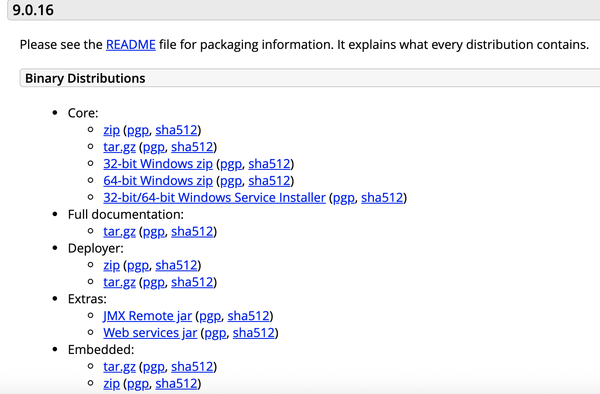
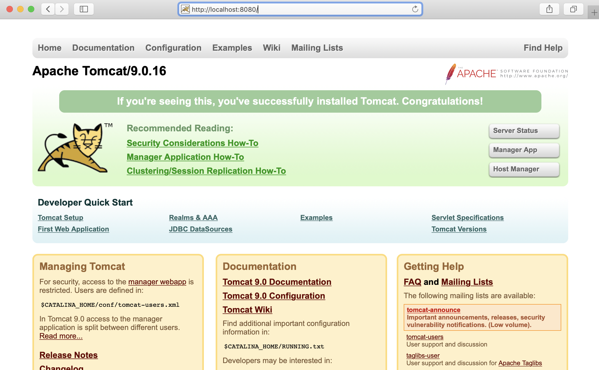

# Tomcat

## 发音说明

Apache Tomcat


## 服务器介绍

Tomcat是Apache 软件基金会（Apache Software Foundation）的Jakarta 项目中的一个核心项目，由Apache、Sun 和其他一些公司及个人共同开发而成。因为Tomcat 技术先进、性能稳定，而且免费，因而深受Java 爱好者的喜爱并得到了部分软件开发商的认可，成为目前比较流行的Web 应用服务器。
目前tomcat最新版本是9.0.16 (2019-02-20)

## Tomcat 9.0.16 安装

官方网址：[https://tomcat.apache.org/](https://tomcat.apache.org/)



说明：

> 1. **Binary Distributions**和**Source Code Distributions**: 分别是二进制版本和源代码包。
> 1. **Core**: 是Tomcat正式的二进制发布版本，一般做开发或学习的时应该下载Core下的对应安装包。
> 1. **Deployer**: 是基于Tomcat的web应用的发布器，就是在把写好的JavaEE应用发布到Tomcat的时候可以使用Deployer来动态的发布。所以它不是真正的Tomcat二进制版本，它只是一个用以发布基于Tomcat的Web应用的发布工具而已


### Step 1

1. 我们此处下载core下面的zip或tar.gz压缩包即可。
1. 将下载好的tomcat安装包，防止到指定的路径，此处笔者放置在新建目录tomcat下。

```text
/Users/用户名/apache/tomcat/9.x/
```

### Step 2

解压缩 `apache-tomcat-9.0.16.zip` , 此时tomcat9解压目录为:

```text
/Users/用户名/apache/tomcat/9.x/apache-tomcat-9.0.16/
```

### Step 3

打开terminal终端，进入tomcat9解压缩目录
```shell
> cd /Users/用户名/apache/tomcat/9.x/apache-tomcat-9.0.16/
```

进入`bin`目录：

```text
> cd /Users/用户名/apache/tomcat/9.x/apache-tomcat-9.0.16/bin/
```

执行 `startup.sh` 尝试启动tomcat。

```shell
> ./startup.sh
```

如果出现以下提示：`Permission denied`, 说明权限异常。

```shell
-bash: ./startup.sh: Permission denied
```

解决方案：给Tomcat启动命令校本赋予权限

```shell
> sudo chmod 755 /Users/用户名/apache/tomcat/9.x/apache-tomcat-9.0.16/bin/*.sh
```

然后，再次执行启动脚本。

```shell
> ./startup.sh
```

打开浏览器，访问 [http://localhost:8080/](http://localhost:8080/), 如果出现如下页面即表示Tomcat成功启动。




